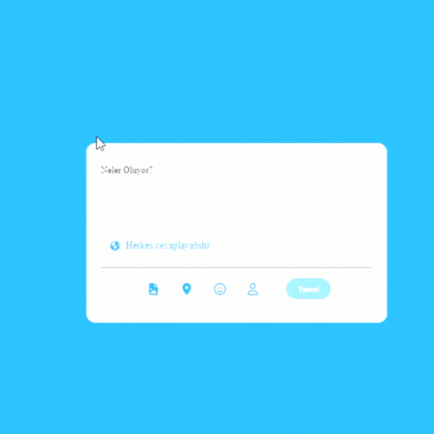

<h1>Tweet Page Project </h1>

This project includes a Twitter message writing panel developed using HTML, CSS and JavaScript. Users can write messages with a limit of 5 characters. If the limit is exceeded, the text is highlighted with a red background.

<h2>Project Features</h2> 
5 character limit.
Warning when the limit is exceeded.
Highlighting characters with red background.

<h3>Technologies Used</h3> 
- Html
- Css
- JavaScript
- FontAwesome

<h4>Project Gif</h4>

